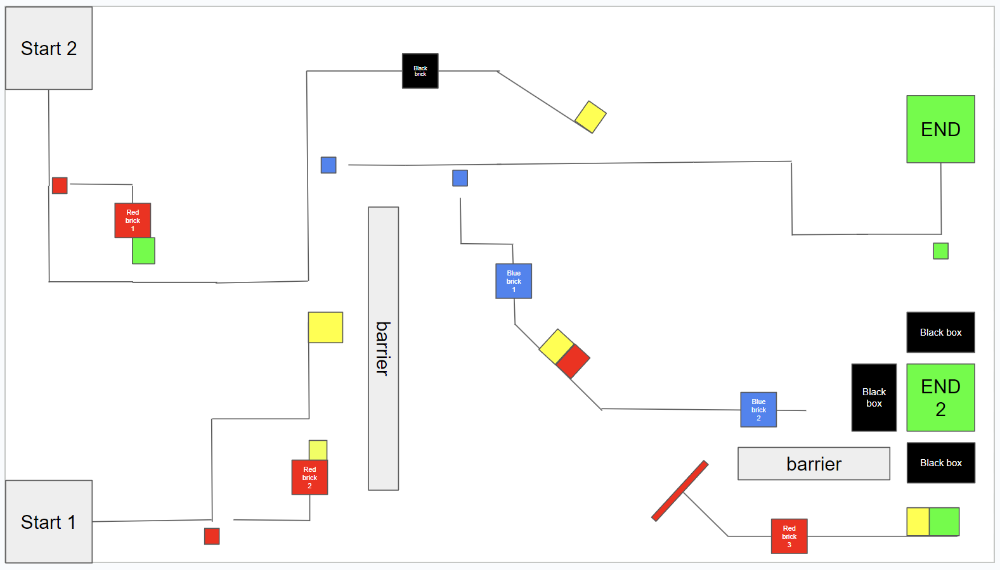

# EIG-Ev3-Line-Tracing
Welcome to the EV3 Line Tracing workshop by EIG.  
This is the codebase that contains all the files that we will use in the Workshop.  
## Step 1: Download EV3 Classroom App
Download the App through this link:  
https://education.lego.com/en-us/downloads/mindstorms-ev3/software/  
Download the files and open the launcher  
## Step 2: Download All the files in the Lesson files
Download all the files in [Lesson files](./Lesson%20Files/)  
OR  
Download the entire repositry as a zip file and unzip it
## Step 3: Follow the Lesson pace on lesson 1 and 2
## Step 4: Lesson 3 - 7  
These Lessons are to be done at your own pace.
After each lesson, notify one of us and we will ensure that you have done the exercise correctly
## Step 5: Prepare for the Competition
You can make your own modification to your robot and complete your code in prepareration for the competition  
The map for the competition is as follows:  

## Enjoy and Have Fun!
